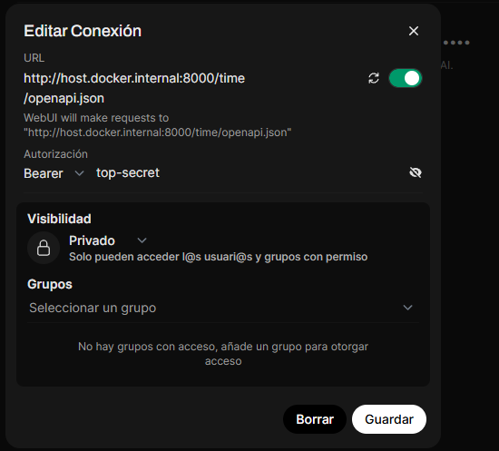

# Entorno-IA

Este repositorio contiene un entorno configurado con servicios de IA utilizando Docker Compose.

## Servicios incluidos

- **Open WebUI**: Interfaz web para interactuar con modelos de IA.
- **Ollama**: Servicio para ejecutar modelos de lenguaje localmente.
- **MCPO**: Proxy seguro de MCP a OpenAPI.

## Requisitos previos

- Docker y Docker Compose instalados en su sistema
- Git para clonar el repositorio

## Despliegue con Docker Compose

1. Clone el repositorio:
   ```bash
   git clone https://github.com/tu-usuario/Entorno-IA.git
   cd Entorno-IA
   ```

2. Inicie todos los servicios:
   ```bash
   docker-compose up -d
   ```

3. Acceda a los servicios:
   - Open WebUI: [http://localhost:3000](http://localhost:3000)
   - Ollama API: [http://localhost:11434](http://localhost:11434)
   - MCPO: [http://localhost:8000](http://localhost:8000)

4. Para detener los servicios:
   ```bash
   docker-compose down
   ```

## Ejecutar MCP por separado

Si desea ejecutar MCP fuera de Docker Compose, puede utilizar la configuración personalizada en la carpeta `mcp-custom`. Esta carpeta contiene un Dockerfile y un archivo de configuración para ejecutar MCP de forma independiente.

### Ejecución con Docker

Para ejecutar el servidor usando Docker, sigue estos pasos:

1. Construir la imagen:
```bash
docker build -t mcp-proxy-server .
```

2. Ejecutar el contenedor:
```bash
docker run -d --name mcp-proxy -p 8000:8000 mcp-proxy-server
```

El servidor estará disponible en `http://localhost:8000`.

3. Para adjuntarlo en OpenWebUI, se debe ir al panel de administrador -> herramientas y agregar una conexión **por servidor** con los siguientes parámetros:



En este ejemplo se hizo con el servidor **/time**. Se debe realizar una nueva conexión poniendo luego de la conexión la ruta con el nombre del servidor que deseamos.

#### Notas adicionales:
- El flag `-d` ejecuta el contenedor en modo detached (background)
- El puerto 8000 está expuesto para acceder al servidor
- Para detener el contenedor: `docker stop mcp-proxy`
- Para ver los logs: `docker logs mcp-proxy`

## Estructura del proyecto

```
Entorno-IA/
├── docker-compose.yaml   # Configuración de Docker Compose
├── mcp-custom/          # Configuración personalizada de MCPO
│   ├── Dockerfile      # Configuración de Docker para MCPO
│   └── config.json     # Configuración de los servidores MCP 
├── README.md            # Este archivo
```

## Contribuciones

Las contribuciones son bienvenidas. Por favor, abra un issue o pull request para sugerencias o mejoras.

## Licencia

Consulte los archivos de licencia individuales en cada subdirectorio del proyecto. 